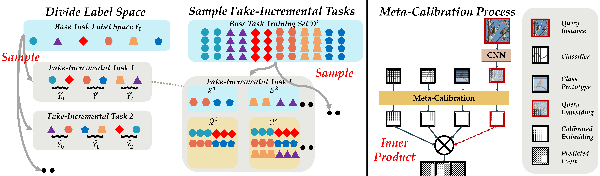
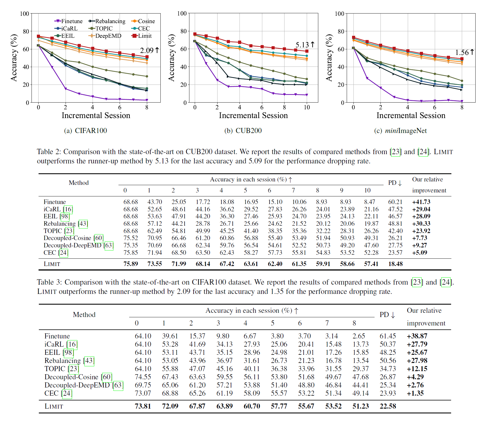

# Few-Shot Class-Incremental Learning by Sampling Multi-Phase Tasks  (LIMIT)

The code repository for "Few-Shot Class-Incremental Learning by Sampling Multi-Phase Tasks
" [[paper]](https://arxiv.org/abs/2203.17030) in PyTorch. If you use any content of this repo for your work, please cite the following bib entry:

    @article{zhou2022few,
    title={Few-Shot Class-Incremental Learning by Sampling Multi-Phase Tasks},
    author={Zhou, Da-Wei and Ye, Han-Jia and Zhan, De-Chuan},
    journal={arXiv preprint arXiv:2203.17030},
    year={2022}
    }

The full code will be released soon.

## Few-Shot Class-Incremental Learning by Sampling Multi-Phase Tasks


New classes arise frequently in our ever-changing world, e.g., emerging topics in social media and new types of products in e-commerce. A model should recognize new classes and meanwhile maintain discriminability over old classes. Under severe
circumstances, only limited novel instances are available to incrementally update the model. The task of recognizing few-shot new classes without forgetting old classes is called few-shot class-incremental learning (FSCIL). In this work, we propose a new paradigm for FSCIL based on meta-learning by LearnIng Multi-phase Incremental Tasks (LIMIT), which synthesizes fake FSCIL tasks from the base dataset. The data format of fake tasks is consistent with the ‘real’ incremental tasks, and we can build a generalizable feature space for the unseen tasks through meta-learning. Besides, LIMIT also constructs a calibration module based on transformer, which calibrates the old class classifiers and new class prototypes into the same scale and fills in the semantic gap. The calibration module also adaptively
contextualizes the instance-specific embedding with a set-to-set function. LIMIT efficiently adapts to new classes and meanwhile resists forgetting over old classes. Experiments on three benchmark datasets (CIFAR100, miniImageNet, and CUB200) and large-scale dataset, i.e., ImageNet ILSVRC2012 validate that LIMIT achieves state-of-the-art performance.



## Results


Please refer to our [paper](https://arxiv.org/abs/2203.17030) for detailed values.

## Prerequisites

The following packages are required to run the scripts:

- [PyTorch-1.4 and torchvision](https://pytorch.org)

- tqdm

## Dataset
We provide the source code on three benchmark datasets, i.e., CIFAR100, CUB200 and miniImageNet. Please follow the guidelines in [CEC](https://github.com/icoz69/CEC-CVPR2021) to prepare them.


## Code Structures
There are four parts in the code.
 - `models`: It contains the backbone network and training protocols for the experiment.
 - `data`: Images and splits for the data sets.
- `dataloader`: Dataloader of different datasets.
 - `checkpoint`: The weights and logs of the experiment.
 
<!-- ## Training scripts

- Train CIFAR100

  ```
  python train.py -projec fact -dataset cifar100  -base_mode "ft_cos" -new_mode "avg_cos" -gamma 0.1 -lr_base 0.1 -lr_new 0.1 -decay 0.0005 -epochs_base 600 -schedule Cosine -gpu 0,1,2,3 -temperature 16 -batch_size_base 256   -balance 0.001 -loss_iter 0 -alpha 0.5 >>CIFAR-FACT.txt
  ```
  
- Train CUB200
    ```
    python train.py -project fact -dataset cub200 -base_mode 'ft_cos' -new_mode 'avg_cos' -gamma 0.25 -lr_base 0.005 -lr_new 0.1 -decay 0.0005 -epochs_base 400 -schedule Milestone -milestones 50 100 150 200 250 300 -gpu '3,2,1,0' -temperature 16 -dataroot YOURDATAROOT -batch_size_base 256 -balance 0.01 -loss_iter 0  >>CUB-FACT.txt 
    ```

- Train miniImageNet
    ```
    python train.py -project fact -dataset mini_imagenet -base_mode 'ft_cos' -new_mode 'avg_cos' -gamma 0.1 -lr_base 0.1 -lr_new 0.1 -decay 0.0005 -epochs_base 1000 -schedule Cosine  -gpu 1,2,3,0 -temperature 16 -dataroot YOURDATAROOT -alpha 0.5 -balance 0.01 -loss_iter 150 -eta 0.1 >>MINI-FACT.txt  
    ```

Remember to change `YOURDATAROOT` into your own data root, or you will encounter errors. -->

  

 
<!-- ## Acknowledgment
We thank the following repos providing helpful components/functions in our work.

- [Awesome Few-Shot Class-Incremental Learning](https://github.com/zhoudw-zdw/Awesome-Few-Shot-Class-Incremental-Learning)

- [PyCIL: A Python Toolbox for Class-Incremental Learning](https://github.com/G-U-N/PyCIL)

- [Fact](https://github.com/zhoudw-zdw/CVPR22-Fact)

- [CEC](https://github.com/icoz69/CEC-CVPR2021) -->


<!-- ## Contact 
If there are any questions, please feel free to contact with the author:  Da-Wei Zhou (zhoudw@lamda.nju.edu.cn). Enjoy the code. -->
